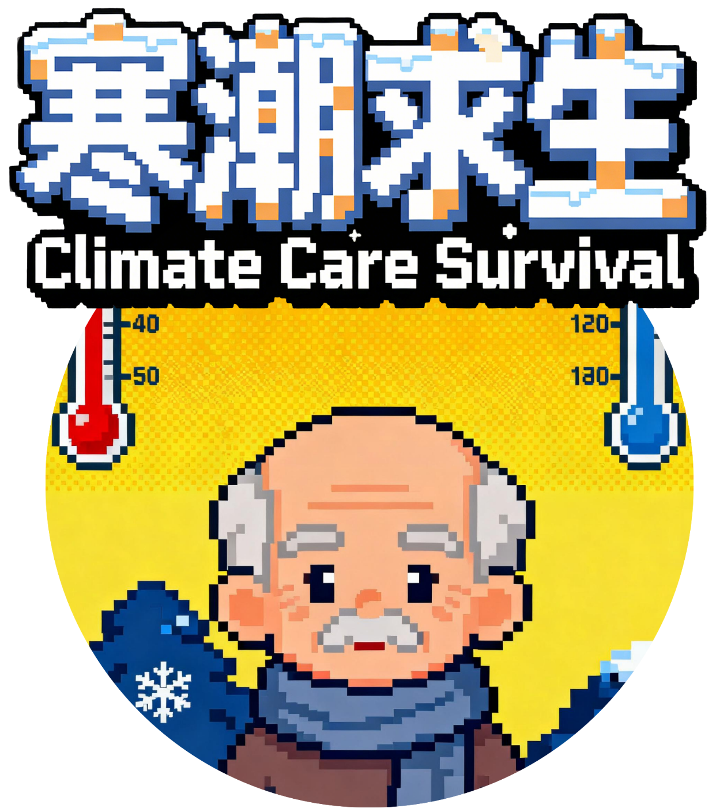
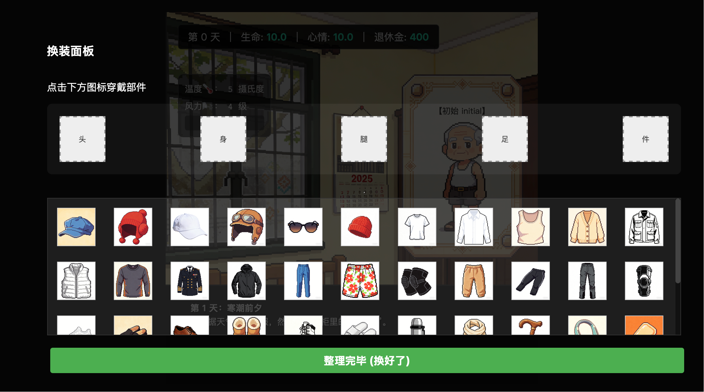
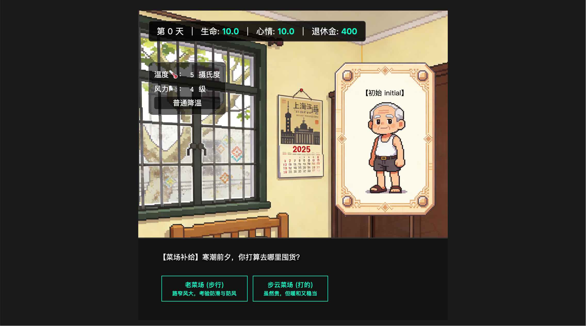

# 🌨️ Climate Care Survival | 寒潮求生

> 帮助老李在寒潮中安全度过，每一件选择都关系到生命、心情与财富。  
> Help Old Li survive the cold wave—every choice affects his health, mood, and pension.

<p align="center">
  
</p>

🎮 Gameplay Preview
> [▶ Watch the Demo Video]https://github.com/minliang327/climate-care-survival/issues/1#issue-3774304012</p>
> ▶ Full demo (1 min): https://youtu.be/Zr5U1hbUkxg?si=jyJu4CAlRmdUEE2P

## 🎮 About the Project | 关于项目

**Climate Care Survival** 是一款策略模拟网页游戏，灵感来源于真实寒潮与老年人居家安全挑战。玩家需要管理老李的健康、心情和财富，通过每日决策与穿衣搭配应对寒潮风险。  
A strategy simulation web game inspired by real cold waves and the challenges of elder home safety. Players manage Old Li’s health, mood, and pension while making daily decisions and outfit choices to survive the cold.

- **Language / 语言**: JavaScript (ES6+), HTML, CSS  
- **Platform / 平台**: Web (modern browsers)  
- **Graphics & Sound / 图像与音效**: Custom-made, placeholder CG and character sprites included  
- **Features / 特点**:  
  - Daily weather & risk events simulation / 每日天气与风险事件模拟  
  - Outfit & equipment system affecting vitals / 装备与衣物系统影响属性  
  - Multi-ending storyline based on choices / 多结局剧情  
  - Future English version planned / 未来英文版计划上线  

---

## 🕹️ How to Play | 游戏玩法

### 1️⃣ Daily Preparation | 每日准备
- 根据天气预报选择装备和生活准备  
- Wealth is limited; choices need trade-offs / 财富有限，需要权衡选择  

### 2️⃣ Dressing & Outing | 穿衣与出行
- Dress according to forecast / 根据天气穿衣  
- Wrong outfits may reduce health and mood / 错误穿衣可能影响健康和心情  

### 3️⃣ Event Decisions | 事件决策
- Indoor tasks, market trips, and daily activities / 室内任务、市场出行、日常事件  
- Player choices directly affect stats and endings / 玩家选择直接影响属性和结局  

### 4️⃣ Multiple Endings | 多结局
- Four endings based on player choices and attribute paths / 根据选择与属性变化产生四种结局  

---

## 📸 Screenshots & Demo | 截图与演示

### Daily UI & Wardrobe | 日常界面 & 换衣系统



### Event & Market Scene | 事件 & 菜市场场景
 
<p align="center">
  
</p>

### CG Placeholder | CG 占位
<p align="center">
  
  
  
</p>

<p align="center">
  
</p>

> Future updates will include dynamic sprites and CG based on player attributes.  
> 后续更新将根据玩家属性呈现动态立绘与 CG

---

## ⚡ Tech Stack | 技术栈

- **Frontend / 前端**: HTML5, CSS3, JavaScript  
- **UI / 用户界面**: DOM rendering + Promise-based async control / DOM 渲染 + Promise 异步控制  
- **Game Logic / 游戏逻辑**: Event handling, outfit matching, stats calculation / 事件处理、穿衣匹配、属性计算  
- **Data / 数据**: JSON-style events & items / JSON 格式每日事件和道具表  
- **Sound / 音效**: `.m4a` files, triggered dynamically / `.m4a` 文件，动态触发  

---

## 🛠️ How We Built It | 项目构建过程

1. **Data-driven design** / 数据驱动设计:  
   Daily events, items, and scripts stored in JSON/JS objects / 每日事件、道具和剧情存储在 JSON/JS 对象中  

2. **Promise-based UI** / Promise 异步 UI:  
   All player interactions return Promises to pause game logic until input / 所有用户操作通过 Promise 暂停剧情逻辑  

3. **Attribute & Outfit Engine** / 属性与穿衣引擎:  
   Calculates health, mood, and risk based on outfit and events / 根据穿衣和事件计算健康、心情与风险  

---

## ⚠️ Challenges & Lessons | 遇到的挑战与学习

- Handling multi-choice events and insufficient funds / 多选事件与财富不足逻辑  
- Seamless UI/UX without blocking the main thread / 无阻塞的 UI/UX 流畅体验  
- Designing scalable JSON-driven event system / 可扩展的 JSON 驱动事件系统  

---

## 🏆 Accomplishments | 成就

- Multi-day survival simulation / 多日生存模拟  
- Multi-ending branching paths / 多结局分支剧情  
- Placeholder CG and dynamic sprites ready for future update / 占位 CG 与动态立绘已准备好  

---

## 🔮 What's Next | 后续规划

- Full English version / 完整英文版上线  
- Richer daily events & branching choices / 更丰富的每日事件与选择  
- Insert dynamic CG & character sprites based on stats / 根据属性插入动态 CG 和立绘  
- Improved sound & music system / 完善音效和背景音乐系统  

---

## 📄 License | 许可证

This project is licensed under [MIT License](LICENSE)  
本项目采用 [MIT License](LICENSE) 开源许可  

---

## 🚀 Quick Start | 快速开始

1. Clone the repo / 克隆仓库:  
```bash
git clone https://github.com/yourusername/climate-care-survival.git
